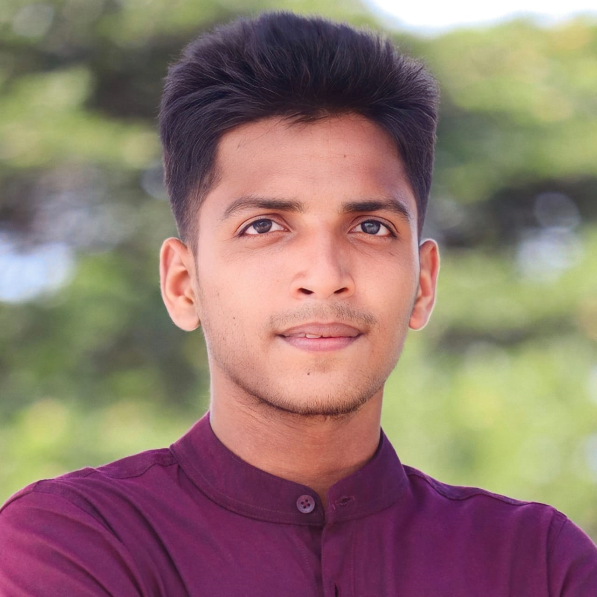

<!-- banner image starts here  -->

<!-- banner image ends here  -->

<h1> 👋 Hello, I'm Fazle Rabby </h1>

A full time web developer  
🏠 &nbsp; Living: Dhaka, Bangladesh

<!-- Contact me section starts here  -->

[][website]
[][facebook]
[][linkedin]
 
 

### 👨‍🏫 &nbsp; About Me

I am a passionate computer science. I have been learn programming languages, web development, and computer science-related subjects. I am a dedicated and resilient individual who approaches challenges with determination and strength. I thrive on problem-solving and always strive to find effective solutions, no matter how complex the situation. My commitment to excellence drives me to persevere until every task is completed successfully, I am improving my web development skills. Every day I want to learn something new and share my knowledge with others.

 

### 👨🏽‍💻 &nbsp; My Skills :

#### Key Skills of Web development:

 
 
 

 

#### Other Skills :

 
 
 
 

   
 
 

### 💼 &nbsp; Employment History

 

### 👨🏻‍🎓 &nbsp; Education

1. B.Sc. in Computer Science & Engineering  
   [][gub]

 

 

### Languages:

- 🇧🇩 Bangla : Native
- 🏴󠁧󠁢󠁥󠁮󠁧󠁿 English : Advanced
- 🇮🇳 Hindi : Intermediate
   

### Sports / Game / Activities / Hobby:

- 🏏 Cricket, ⚽ Football, 🏸 Badminton, ♟️ Chess
- 🏊‍♂️ Swimming, 🏃‍♂️ Running, 🚶‍♂️ Walking
- ✈️ Travelling

 

---

Thanks for going through my Portfolio.
All rights reserved by william_fazle @2025

---

[website]: https://williamfazle.github.io/
[facebook]: https://www.facebook.com/williamfazle1
[linkedin]: https://www.linkedin.com/in/fazle-rabby-green221002378/
[github]: https://github.com/williamfazle
[gub]: https://green.edu.bd/